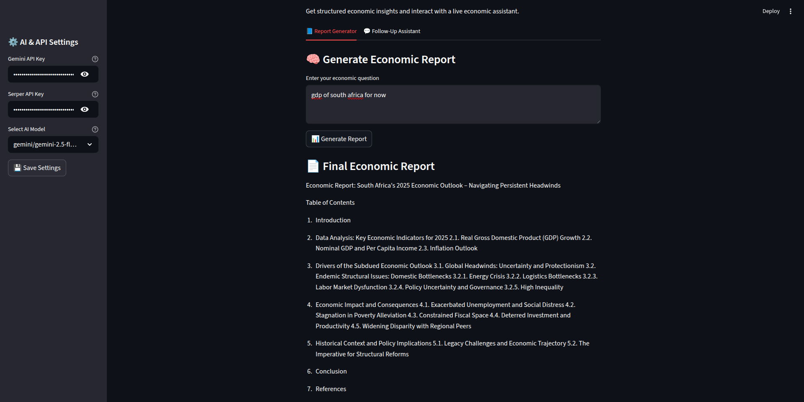
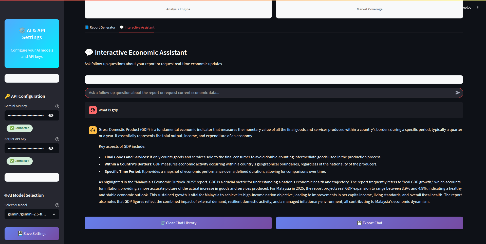

# 🌍 WorldEconomics Crew

**WorldEconomics Crew** is a powerful multi-agent system powered by [crewAI](https://crewai.com). It enables collaborative AI workflows for complex economic research—such as generating structured reports and answering follow-up queries—through intelligent agent coordination.

---

## 📸 App Showcase

<p align="center">
  
  <em>Figure 1: Report Generation Interface</em>
</p>

<p align="center">
  
  <em>Figure 2: Follow-up Question Chatbot Interface</em>
</p>

---

## 🚀 Features

- 📊 Generate in-depth economic reports from natural language queries
- 💬 Interact with a follow-up chatbot trained on your generated report
- 🤖 Powered by multiple specialized agents using [crewAI](https://crewai.com)
- 🧠 Seamless integration with tools like OpenAI, custom search, and more
- 📦 Simple and scalable architecture using Python and `uv` for dependency management

---

## 🛠️ Installation

Ensure Python **>=3.10 and <3.13** is installed.

### 1. Install [uv](https://docs.astral.sh/uv/)

```bash
pip install uv
```

### 2. Clone and install dependencies

```bash
git clone https://github.com/your-org/world_economics.git
cd world_economics
crewai install
```

### 3.🧪 Running the Project

From CLI (default report generation)

```bash
crewai run
```

This generates a report.md file in the root directory.

From UI (Streamlit app)

```bash
streamlit run app.py
```

- Ask a question like "How does the Fed’s interest rate policy affect developing economies?"

- Wait for a structured report to be generated

- Ask follow-up questions via integrated chatbot

## 🧱 Project Structure

```
.
├── app.py                       # Streamlit application
├── final_report.md             # Output report
├── knowledge/                  # Custom data and prompts
│   └── user_preference.txt
├── src/world_economics/        # Main project logic
│   ├── config/                 # YAML config for agents & tasks
│   ├── tools/                  # Custom tools (e.g. Serper, scraping)
│   ├── crew.py                 # Crew configuration (main agents)
│   ├── chat_crew.py            # Chat follow-up crew
│   └── main.py                 # CLI runnable entry point
├── tests/                      # (Optional) Test suite
├── pyproject.toml              # Project metadata
└── uv.lock                     # Locked dependencies
```

## 💡 How It Works

- Define agents with goals and backstories (e.g., Analyst, Researcher, Chat Assistant)

- Create tasks for each stage of the report generation or follow-up

- Kickoff a Crew, where agents collaborate in sequential or hierarchical workflows

- Use the Streamlit app for an interactive experience

## 📘 Example Use Case

- User enters: "What impact does China's monetary policy have on global inflation?"

- A report is generated and saved as final_report.md

- User asks: "How does this compare to the U.S. policy in 2023?"

- Chat agent analyzes the report and responds intelligently
